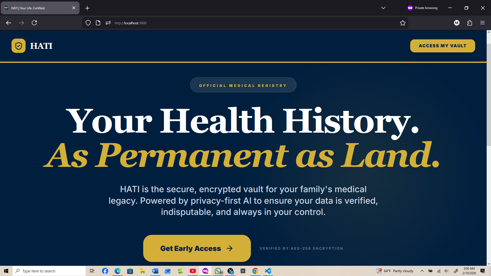
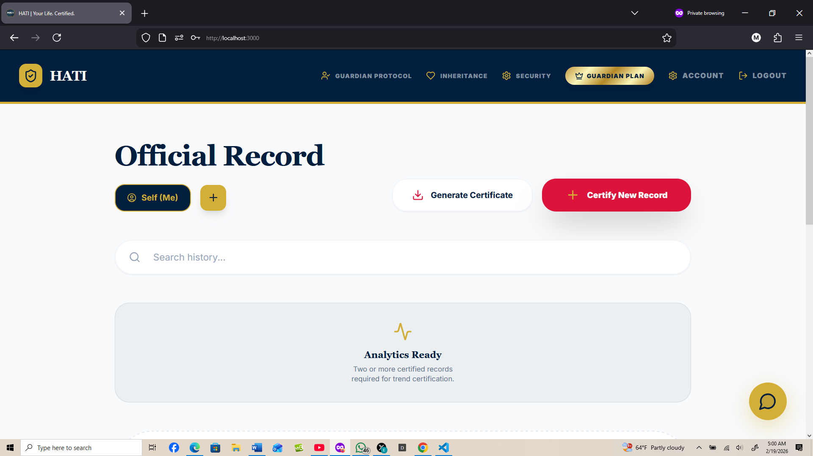
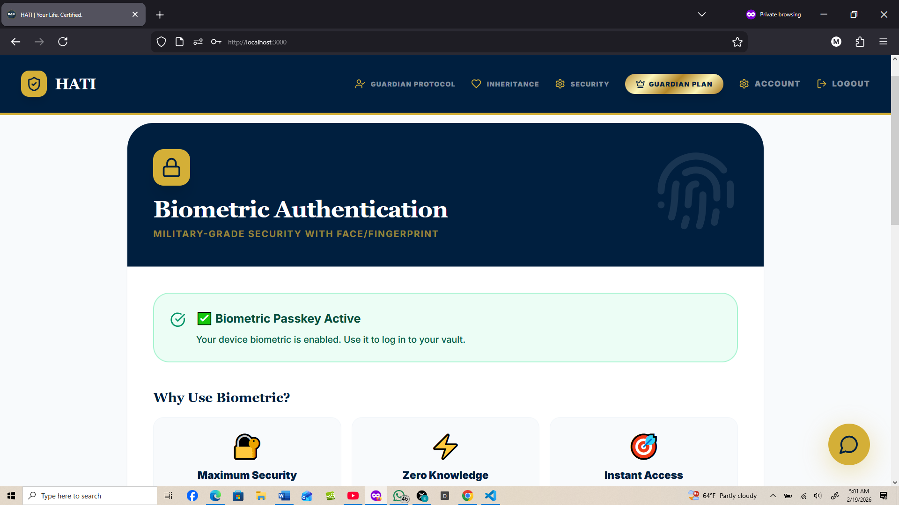
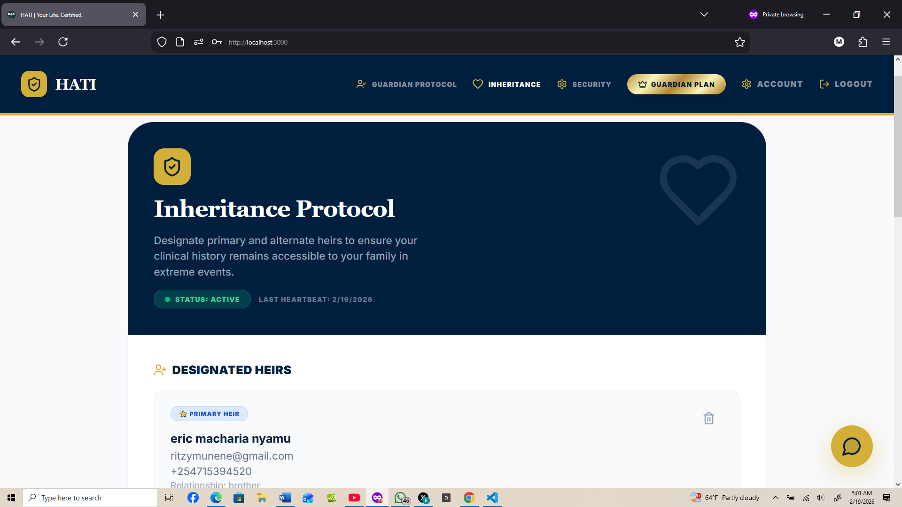

HATI Smart Scribe

Privacy-first medical record extraction and registry for low-resource environments.

HATI Smart Scribe automates digitization of clinical forms using in-browser OCR (Tesseract.js) and deterministic heuristics to extract vitals, medications, and diagnoses. Optional backend LLM refinement is available but disabled by default to avoid pay-as-you-go billing.

---

## Tech stack
- Frontend: React + Vite + TypeScript
- OCR: Tesseract.js (browser)
- Dev server: Express (local dev), Vercel functions for production
- Security: client-side encryption + secure upload gateway

## Problem statement
Manual paper records are hard to index, share, and protect. HATI Smart Scribe provides a low-cost, privacy-first pipeline to digitize clinical records for clinics and field workers without relying on continuous cloud LLM billing.

## Key features
- In-browser OCR extraction (no server billing)
- Heuristic parsers for vitals, medications, diagnoses
- PDF stitching option (Secure Scanner)
- Optional server-side LLM pipeline (disabled by default)
- Encrypted record storage & registry integration

## Architecture
- Browser: upload/photo → `extractFromImage` (Tesseract) → heuristic parsers → verification UI
- Dev server: `/api/extract-medical` proxy to local Express during dev (501 if disabled)
- Production: static site on Vercel; serverless extraction route optional with env-protected API keys
- Security: keys never exposed client-side; encryption before storage/transport

## Methodology (OCR / ML)
- OCR: Tesseract.js with lightweight preprocessing (orientation, resizing)
- Parsing: rule-based regex extraction tuned for clinical form layouts
- Optional: LLM refinement step (server-side; requires credentials and billing)

## Installation (developer)
1. Clone repo
2. Copy `.env.local.example` → `.env.local` and set values
3. Install:
```bash
npm install
```
4. Run dev:
```bash
npm run dev
```

## Usage
- Capture or upload an image/PDF in the Medical Uploader
- Review and verify extracted fields
- Save encrypted record to registry

## Deployment
- Frontend: Vercel (static)
- Optional backend: Vercel Serverless Function — set `GEMINI_API_KEY` on Vercel only if enabling LLM features

## Screenshots

### Landing Page
Privacy-first positioning and onboarding.


### Medical Record Registry
Upload, verify, and certify clinical records with encrypted storage.


### Biometric Security
Military-grade face/fingerprint authentication for vault access.


### Inheritance Protocol
Designate heirs to ensure family access to medical history during emergencies.


## Evaluation & Metrics
- OCR accuracy (character error rate), field-level precision/recall
- Processing time (ms) on mobile vs desktop
- Failure modes and fallback (handwriting/low contrast)

## What to highlight for recruiters
- Problem complexity and domain constraints (privacy, offline-first, low-resource)
- Algorithmic decisions (parsers, heuristics, normalization)
- Engineering rigor (encryption, tests, CI, reproducible builds)
- Research mindset: evaluation metrics, error analysis, iterative improvements

## License
MIT
